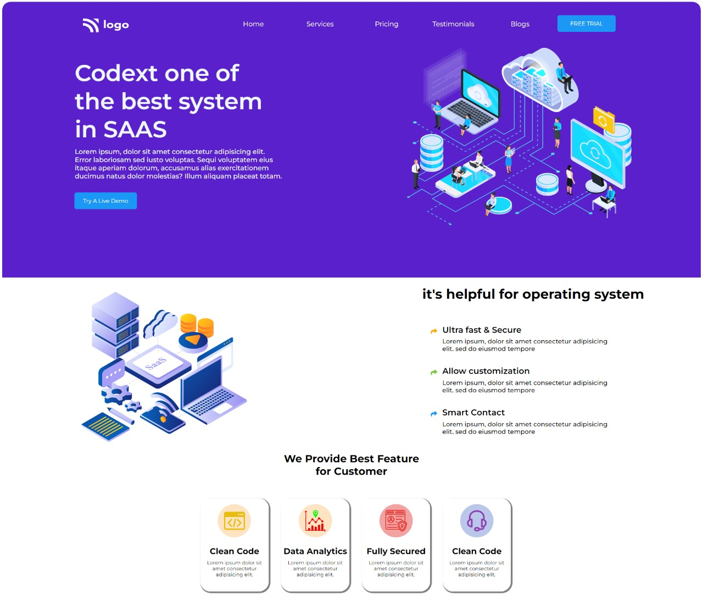

# Project-13- SAAS Landing page.
 ## Hey there ,  I am Amarjeet kumar
 I have build a template of HTML and CSS project using my core css skills.
 
 
 
 

 My Live Deployed Website Link :- [Click here !](https://project-13-saas-landing-page.netlify.app/)

 
 

 ## What I have learned in this project .
 - First of all I learned about  flex box.
 - Also I learned about hover effects.
 - How I change color of any font awsome icons.
 - A little bit about position.

